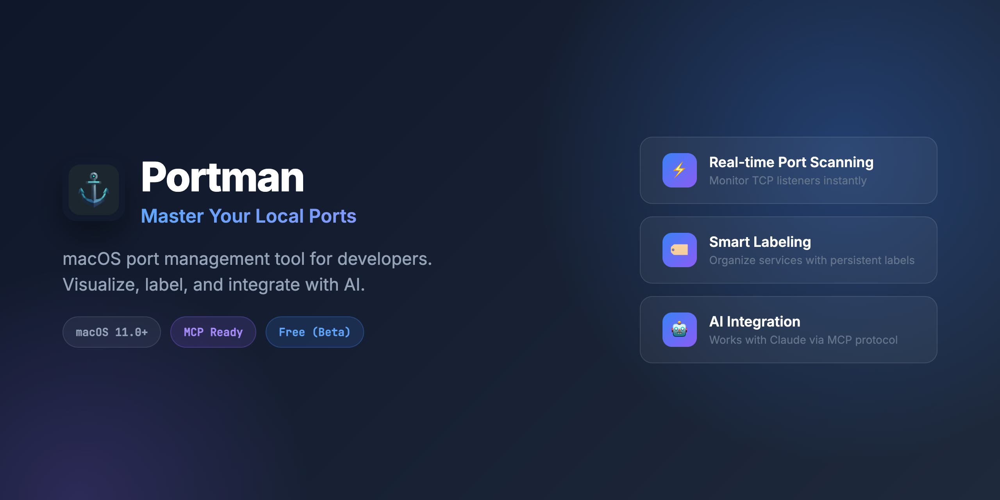

# Portman



[](https://www.npmjs.com/package/portman-mcp)

Portmanは、macOS向けのローカルポート使用状況の可視化・管理ツールです。
デスクトップアプリ、CLIツール、およびMCP（Model Context Protocol）サーバーとして機能します。

開発者が「どのポートが使用中か」を即座に把握し、ポート競合や開発環境の混乱を防ぐために作られました。

## 特徴

- **リアルタイムスキャン**: `lsof` を利用して現在LISTEN状態のTCPポートを一覧表示
- **インテリジェントな推論**: プロセス名やポート番号から、起動中のアプリ（Vite, Next.js, Python等）を推測
- **フリーポート検索**: 指定範囲内から安全に使える空きポートを検索・提案
- **永続ラベル**: ポート、PID、またはコマンドパターン（正規表現）にラベルを付与しDBに保存
- **MCP対応**: Claude Code/Desktop などのAIエージェントから直接ポート情報を取得・操作可能

## 必須要件

- macOS 11.0+ (Big Sur and later)
- Apple Silicon native

## コンポーネント構成

| コンポーネント | 説明 | ライセンス |
|---------------|------|-----------|
| デスクトップアプリ | ネイティブGUIアプリ (Tauri) | Proprietary EULA |
| portman-cli | CLIツール | Proprietary EULA |
| portman-mcp | MCPサーバー (npm公開) | MIT |

## インストール

### デスクトップアプリ（推奨）

[GitHub Releases](https://github.com/zeroshotlog/portman/releases) からDMGをダウンロード。

> **Note**: 現在未署名のため、初回起動時は右クリック→「開く」が必要です。

### MCPサーバー（AIエージェント連携用）

```bash
npx portman-mcp
```

### ソースからビルド（開発者向け）

```bash
# 全体ビルド
cargo build --workspace

# テスト
cargo test --workspace

# CLIを直接実行
cargo run -p portman_cli -- scan

# デスクトップアプリをビルド
cargo tauri build --bundles dmg
```

## CLI の使い方

### 基本コマンド

| コマンド | 説明 |
| --- | --- |
| `portman scan` | アクティブなリスナー一覧を表示 |
| `portman scan --json` | JSON形式で出力 |
| `portman ports find` | 空きポートを検索 (デフォルト: 3000-8000から10個) |
| `portman who <port>` | 特定ポートの詳細情報を表示 |

### ラベル管理

アプリに名前を付けて管理できます。

```bash
# ポート番号で固定して名前を付ける
portman label set --port 5173 --name "My React App" --note "メインフロントエンド"

# PIDで一時的に名前を付ける
portman label set --pid 12345 --name "Worker"

# コマンドの正規表現パターンで名前を付ける（推奨）
# 例: "uvicorn main:app --reload" で起動するアプリを自動検出
portman label set --pattern "uvicorn.*main:app" --name "API Backend"
```

## MCP (Model Context Protocol) の設定

AIエージェント（Claude Code 等）からPortmanを利用するための設定です。

### 1. Claude Code

```bash
claude mcp add portman -- npx portman-mcp
```

### 2. Claude Desktop

`claude_desktop_config.json` に以下を追記してください：

```json
{
  "mcpServers": {
    "portman": {
      "command": "npx",
      "args": ["portman-mcp"]
    }
  }
}
```

### 3. Antigravity

`~/.gemini/antigravity/mcp_config.json` に以下を追記してください：

```json
{
  "mcpServers": {
    "portman": {
      "command": "npx",
      "args": ["portman-mcp"]
    }
  }
}
```

### アップデート方法

npx はパッケージをローカルにキャッシュします。最新版に更新するには：

```bash
npx portman-mcp@latest
```

常に最新版を使用したい場合は、MCP設定で `portman-mcp@latest` を指定してください：

```bash
# Claude Code
claude mcp remove portman
claude mcp add portman -- npx -y portman-mcp@latest
```

Claude Desktop / Antigravity:

```json
{
  "mcpServers": {
    "portman": {
      "command": "npx",
      "args": ["-y", "portman-mcp@latest"]
    }
  }
}
```

### 提供されるツール一覧

| ツール名 | 説明 |
| --- | --- |
| `scan_listeners` | ポート一覧の取得 |
| `who` | 特定ポートの詳細確認 |
| `ports_find` | 空きポート検索 |
| `label_set_*` | ラベルの設定（ポート/PID/パターン） |
| `label_list` | ラベル一覧取得 |
| `label_remove_*` | ラベル削除 |

## ライセンス

- **デスクトップアプリ / CLI**: Proprietary EULA（[LICENSE](./LICENSE) 参照）
- **portman-mcp**: MIT License

---

© 2026 zeroshotlog
